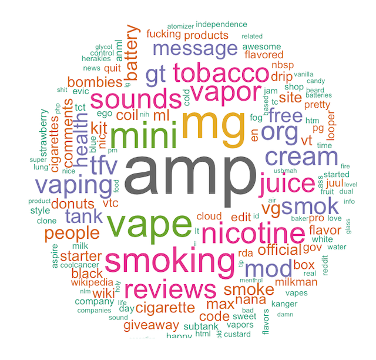

## Data Science Projects

### [Project 1: Natural Language Processing - E-cigarette Subreddits: Project Overview](https://github.com/cbarlow6/Natural_Language_Processing)
Tobacco companies employ social media to market their products to youth and young adults. Cessation and prevention campaigns require an understanding of how this population communicates about and uses these products. A key challenge for surveillance of the products and understanding their patterns of use is the diverse and nonstandard nomenclature for the devices (Alexander et al. 2016). These devices are referred to, by the companies themselves, and by consumers, as “e-cigarettes,” “e-cigs,” “cigalikes,” “e-hookahs,” “mods,” “vape pens,” “vapes,” and “tank systems.” 

We hope to gain insight into tobacco marketing and patterns of use by analyzing social media platforms. Our project focuses on smoking among youth and young adults, and we believe Reddit is a platform used by this group. We wish to learn how tobacco companies communicate with this population and how this population communicates among itself on the subject of e-cigarettes. 

